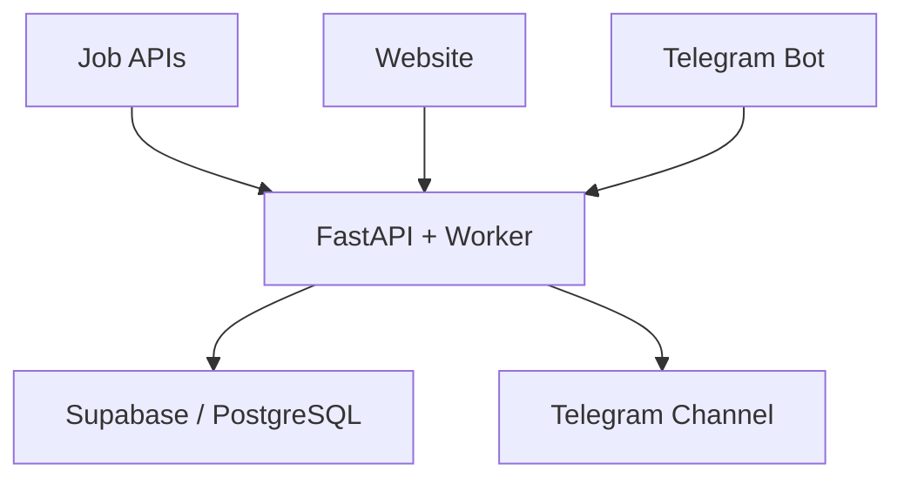

<div align="center">

# 🤖 MrKarirBot

### Temukan Karier Impianmu Bersama AI

Platform karier berbasis AI yang menghubungkan website, bot Telegram, channel lowongan, dan data pekerjaan asli dalam satu ekosistem.

[](https://www.python.org/)
[](https://fastapi.tiangolo.com/)
[](https://t.me/MrKarirAI)
[](https://supabase.com/)
[](https://redis.io/)

**Status:** Active Development · MVP

[Repository](https://github.com/MrKarirBotku/MrKarirBot) · [Telegram Channel](https://t.me/MrKarirAI) · [Roadmap](docs/ROADMAP.md) · [Project Structure](docs/STRUCTURE.md)

</div>

## ✨ Tentang MrKarirBot

MrKarirBot adalah **AI Career Assistant** untuk membantu pencari kerja Indonesia menemukan peluang kerja asli, mempersiapkan dokumen lamaran, dan mengelola perjalanan karier secara lebih terstruktur.

Satu backend dan satu database digunakan untuk melayani website publik, bot Telegram, dan channel Telegram. Worker mengambil lowongan dari API publik, menormalkan data, menghapus duplikasi, menyimpannya ke PostgreSQL/Supabase, lalu memublikasikan lowongan baru secara otomatis.

### Sumber lowongan MVP

- **Remotive** untuk lowongan remote dengan atribusi dan tautan sumber yang dipertahankan.
- **Arbeitnow** untuk lowongan Eropa dan remote.
- Data contoh tidak digunakan sebagai lowongan produksi.

## 🚀 Fitur dan Roadmap

| Fitur | Status | Keterangan |
|---|---|---|
| Website lowongan | 🟢 MVP | Pencarian dan tampilan lowongan publik |
| Bot Telegram | 🟢 MVP | Pencarian lowongan melalui Telegram |
| Agregator lowongan | 🟢 MVP | Sinkronisasi Remotive dan Arbeitnow |
| Publikasi channel | 🟢 MVP | Mengirim lowongan baru ke `@MrKarirAI` |
| Akun dan bookmark | 🟡 Phase 2 | Profil pengguna dan lowongan tersimpan |
| Tracker lamaran | 🟡 Phase 2 | Pemantauan progres lamaran kerja |
| Notifikasi personal | 🟡 Phase 2 | Pemberitahuan berdasarkan preferensi |
| CV ATS dan cover letter | 🔵 Phase 3 | Bantuan penyusunan dokumen lamaran |
| Interview AI | 🔵 Phase 3 | Simulasi dan evaluasi wawancara |
| Rekomendasi karier | 🔵 Phase 3 | Rekomendasi berdasarkan profil pengguna |

WhatsApp Business API tidak termasuk roadmap aktif sementara waktu. Detail selengkapnya tersedia di [`docs/ROADMAP.md`](docs/ROADMAP.md).

## 🏗️ Arsitektur Singkat



## 🧰 Teknologi Utama

- **Backend:** Python 3.11+, FastAPI, Uvicorn
- **Bot:** Telegram Bot dan webhook
- **Database:** PostgreSQL/Supabase, SQLAlchemy async
- **Cache dan worker:** Redis dan scheduled worker
- **Website:** Web responsif dalam folder `web`
- **Quality:** Pytest, Ruff, dan dokumentasi proyek

## 📁 Struktur Folder

- `app/main.py`: factory FastAPI dan middleware rate limiter.
- `app/api/v1`: REST API versi 1 untuk health, AI, auth, jobs, dan Telegram webhook.
- `app/core`: konfigurasi dan keamanan.
- `app/database`: koneksi database async SQLAlchemy, model, dan repository.
- `app/database/models`: model PostgreSQL inti untuk user, profile, jobs, bookmark, tracker lamaran, dan audit log.
- `app/services`: business logic AI dan lowongan.
- `app/sources`: adapter sumber lowongan asli.
- `app/workers/jobs.py`: sinkronisasi dan publikasi channel terjadwal.
- `app/bot`: handler, keyboard, state, webhook, dan bootstrap Telegram Bot.
- `web`: website publik responsif.
- `tests`: unit/API tests.
- `docs`: dokumentasi arsitektur, struktur, roadmap, dan deployment.

Struktur lengkap tersedia di [`docs/STRUCTURE.md`](docs/STRUCTURE.md).

## ✅ Prerequisites

- Python 3.11 atau lebih baru
- Docker dan Docker Compose
- PostgreSQL/Supabase
- Redis
- Bot Telegram dari BotFather

## ▶️ Menjalankan Lokal

1. Salin konfigurasi environment:

   ```bash
   cp .env.example .env
   ```

2. Isi `.env` dengan konfigurasi lokal. Jangan pernah memasukkan token atau API key ke repository.

3. Jalankan aplikasi:

   ```bash
   docker compose up --build
   ```

4. Buka API di `http://localhost:8000` dan dokumentasi Swagger di `http://localhost:8000/docs`.

5. Jalankan worker pada terminal kedua:

   ```bash
   python scripts/run_job_worker.py
   ```

## 🧪 Menjalankan Test

```bash
pip install -e '.[dev]'
pytest
ruff check .
```

### Expected output

- API dapat diakses melalui port `8000`.
- Endpoint health merespons tanpa error.
- Worker mulai menyinkronkan lowongan sesuai jadwal.
- Seluruh test dan pemeriksaan Ruff selesai tanpa kegagalan.

### Troubleshooting

- Jika environment variable tidak ditemukan, periksa kembali `.env` berdasarkan `.env.example`.
- Jika database gagal terhubung, pastikan `DATABASE_URL` benar dan database dapat diakses.
- Jika Redis gagal terhubung, pastikan `REDIS_URL` benar dan service Redis berjalan.
- Jika webhook tidak merespons, periksa URL HTTPS, secret webhook, dan status bot Telegram.

## 🌐 Deployment

1. Simpan seluruh nilai `.env.example` sebagai environment variable atau secret platform.
2. Gunakan migration Supabase yang dikelola pada project produksi. Jangan menjalankan migration Alembic lama terhadap database Supabase yang sudah berisi skema premium.
3. Buat service web dengan command `uvicorn app.main:app --host 0.0.0.0 --port $PORT`.
4. Buat service worker dari repository yang sama dengan command `python scripts/run_job_worker.py`.
5. Isi `TELEGRAM_CHANNEL_ID=@MrKarirAI` dan jadikan bot sebagai admin channel.
6. Isi `TELEGRAM_WEBHOOK_SECRET` dengan nilai acak, lalu jalankan `python scripts/set_telegram_webhook.py`.
7. Jangan commit token atau key. Simpan semuanya di secret manager platform deployment.
8. Untuk polling bot saat pengembangan lokal, jalankan `python scripts/run_telegram_polling.py`.

## 🔌 Endpoint Utama

```text
GET  /api/v1/jobs?q=customer+support&remote=true
GET  /api/v1/jobs/{id}
POST /api/v1/jobs/sync/run
POST /api/v1/jobs/publish/run
POST /api/v1/telegram/webhook
```

Endpoint `sync/run` dan `publish/run` memerlukan akses admin.

## 👨‍💻 Pengembang

**Kusnadi Yohanes Ariyanto** — Tech enthusiast dan aspiring AI developer yang tertarik pada backend API, automation, AI, jaringan, dan cybersecurity.

[](https://www.linkedin.com/in/kusnadi-ya-9276a1317)
[](https://t.me/MrKarirAI)

## 🔒 Keamanan

- Jangan commit `.env`, token Telegram, API key, password database, atau secret lainnya.
- Laporkan masalah keamanan secara privat dan hindari membuka data sensitif pada issue publik.
- Periksa [`SECURITY.md`](SECURITY.md) untuk kebijakan pelaporan keamanan apabila tersedia.

---

<div align="center">

**Dikembangkan untuk membantu pencari kerja menemukan peluang dan mempersiapkan karier dengan lebih baik.**

</div>
